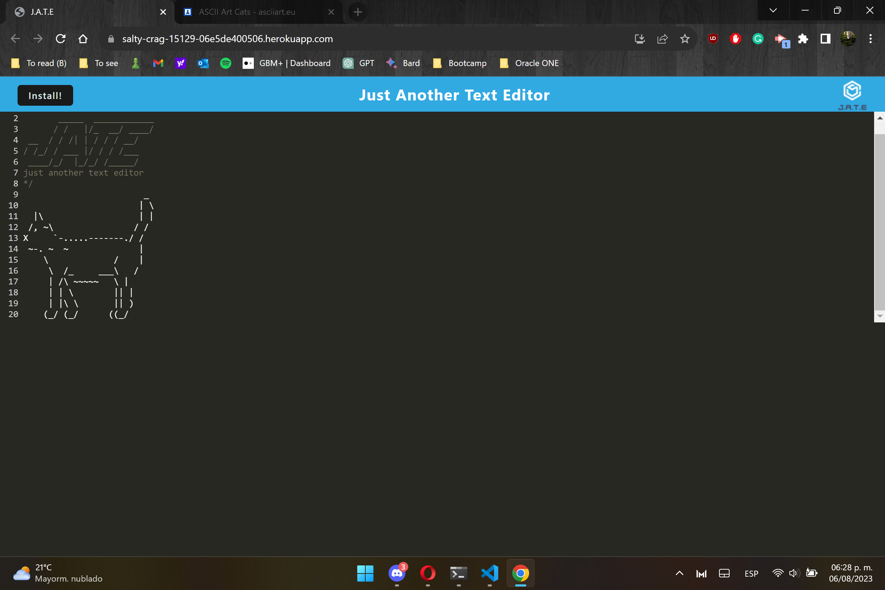

# M19C Text Editor Progressive Web Application (PWA)-ECR

## Description

This Text Editor is a browser-based application that serves as a versatile text editor. Designed as a single-page Progressive Web Application (PWA), it boasts features that adhere to PWA criteria and incorporates various data persistence techniques, ensuring redundancy in case certain options are unsupported by the browser. The application is also fully functional offline.

## Table of Contents
- [ Walkthrough ](#walkthrough)
- [ Instalation ](#instalation)
- [ Usage ](#usage)
- [ License](#license)
- [ Contributing](#Contributing)
- [ Test ](#test)
- [ Questions ](#questions)

## Walkthrough

The following gif demonstrates the functionality of the application: 

You can see the [deployed page here.](https://salty-crag-15129-06e5de400506.herokuapp.com/)

## Instalation

To install necessary dependencies, run the following command:

> npm install

> npm run start:dev

## Usage

1. You can access the [deployed page](https://classique-mandarine-05607-7805819f20f7.herokuapp.com/) and click the "install" button to create a local instance on your device.

 or 
 
 2. Clone this repository to your computer and follow the installation process outlined above.

  
## License
    
This project is licensed under the following license:

## Contributing

This repository is open source and contributions are welcome. If you have any ideas for improvements, please feel free to open an issue or submit a pull request.

## Questions

If you have any questions about the repo, open an issue or contact me directly at [cruz.rosales.ernesto@gmail.com](mailto:cruz.rosales.ernesto@gmail.com). You can find more of my work at [neto1895](https://github.com/neto1895)

